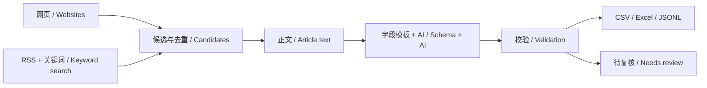

# Global Knowledge Pipeline (by GKN)
# GKN全球信息采集程序

**把分散的网页、订阅源和关键词搜索，整理成你自己的信息表。** 配置来源、目标字段和服务接口，程序会发现候选、提取正文、合并重复内容，再按字段要求进行 AI 富化，输出带来源和复核状态的 CSV、Excel 或 JSONL。

**Turn scattered websites, feeds, and keyword searches into your own information table.** Configure your sources, desired fields, and service endpoints. The pipeline discovers candidates, extracts article text, merges exact duplicates, enriches records with your chosen AI service, and exports CSV, Excel, or JSONL with provenance and review status.

**选择语言 / Choose your guide:** [完整中文说明](README.zh-CN.md) · [Full English guide](README.en.md)

Python 3.9+ · 离线示例无需依赖或密钥 / Offline demo needs no dependencies or keys · v0.1.0

## 从信息到表格 / From information to a table



| 你提供 / You configure | 程序完成 / The pipeline handles |
| --- | --- |
| 网页、RSS、列表页、关键词 / Websites, RSS, listing pages, queries | 发现信息、合并来源、保存增量进度 / Discovery, provenance merging, incremental checkpoints |
| 字段名称、类型、解释、必填项 / Field names, types, instructions, requirements | 按模板富化，校验类型、枚举和证据摘录 / Schema-driven enrichment and validation |
| 搜索与富化接口 / Search and enrichment endpoints | 请求与返回映射，环境变量凭据 / Request/response mapping and environment credentials |
| 条目、请求和 token 预算 / Item, request, and token budgets | 限额暂停，保留已保存的成功结果 / Pause at configured limits and reuse persisted results |

适合行业动态、政策监测、产品更新和公开研究资料的持续收录。字段由你定义，不绑定特定行业或模型供应商。 / Use it for recurring intake of industry developments, policy notices, product updates, and public research. You define the fields; the core does not depend on a particular industry or model vendor.

## 三步试用 / Try it in three steps

在项目目录运行；示例完全离线，不会访问虚构网址。 / Run from the project directory. The demo is fully offline and does not contact its fictional URLs.

```bash
python3 -m gkp validate examples/demo.json
python3 -m gkp run examples/demo.json
python3 -m gkp run examples/demo.json
```

第一次运行的预期结果 / Expected first run:

```text
4 candidates → 3 records + 1 exact-body duplicate
2 validated · 1 needs_review · 0 HTTP requests
```

第二次运行复用已保存的富化结果，模拟 AI 调用次数为 0。示例故意保留一条缺少摘要的记录，让你看到复核队列如何工作。 / The second run reuses persisted enrichment results and makes zero simulated AI calls. One record deliberately lacks a summary so you can inspect the review queue.

打开 `runtime/fictional_updates/output/table.xlsx` 查看表格；`records.jsonl` 保留正文、证据和处理信息，`run-report.json` 解释本次运行结果。 / Open `runtime/fictional_updates/output/table.xlsx` for the table. `records.jsonl` retains article text, evidence, and processing metadata; `run-report.json` explains the run.

## 从演示到实际使用 / Move from demo to your workflow

1. 修改或复制 [字段模板](examples/product-template.json)，也可参考[政策模板](examples/policy-template.json)。 / Adapt the [field template](examples/product-template.json), or start from the [policy template](examples/policy-template.json).
2. 复制 [实际接入配置示例](examples/live.example.json)，替换来源、接口地址和模型名称。 / Copy the [live configuration example](examples/live.example.json) and replace sources, endpoints, and the model name.
3. 在环境变量中设置自己的凭据，先以小预算运行。 / Set your own credentials in environment variables and begin with a small budget.

配置示例中的 `example.*` 地址是占位符，不提供可用服务。 / The `example.*` endpoints are placeholders, not working services.

## 深入使用 / Go further

- [字段与配置 / Templates and configuration](docs/configuration.md)
- [搜索、模型和自定义 API / Service adapters](docs/adapters.md)
- [增量、恢复、输出和限制 / Running and recovering jobs](docs/operations.md)
- [架构与扩展 / Architecture and extension points](docs/architecture.md)
- [贡献 / Contributing](CONTRIBUTING.md)

`validated` 表示通过程序的结构和证据摘录检查，不表示事实已被人工确认。普通网页提取不是对所有网站的支持承诺；可选浏览器适配器需要额外安装。原站原有内容更新、复杂分页、PDF 和已有复杂 Excel 文件回填不在当前版本范围内。 / `validated` means the record passed structural and excerpt checks, not human fact-checking. Basic HTML extraction does not guarantee compatibility with every site. The optional browser adapter requires additional installation. Refreshing changed content at existing URLs, general pagination, PDFs, and filling complex existing Excel workbooks are outside this release.

**许可证 / License:** [Apache-2.0](LICENSE) · [版权与来源声明 / Notices](NOTICE)

**仓库 / Repository:** [workstonedai-collab/global-knowledge-pipeline](https://github.com/workstonedai-collab/global-knowledge-pipeline)
