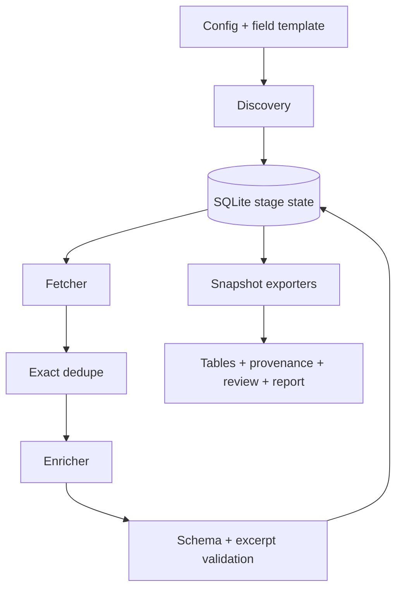

# 架构与扩展 / Architecture and extension points

| 模块 / Module | 职责 / Responsibility |
| --- | --- |
| `config.py` | 加载配置、模板与预算 / Configuration, templates, budgets |
| `discovery.py` | RSS/Atom、网页列表、关键词结果映射 / Feed, listing, search discovery |
| `fetching.py` | HTML、可选浏览器、robots / HTML, optional browser, robots |
| `http.py` | 请求、环境变量认证、地址与重定向检查 / Requests, environment auth, address/redirect checks |
| `state.py` | 候选、正文、去重关系、富化缓存、时间窗 / Candidates, bodies, duplicates, cached enrichment, checkpoints |
| `enrichment.py` | 通用提示词与服务适配 / Generic prompt and service adapters |
| `schema.py` | 字段类型、必填、枚举与证据摘录校验 / Field and excerpt validation |
| `exports.py` | 文件快照、表格与复核输出 / Snapshot files, tables, review output |
| `pipeline.py` | 阶段编排、锁、重试、报告 / Orchestration, locking, retries, reports |
| `cli.py` | 用户命令与安全错误输出 / Commands and safe errors |

当前适配器为显式配置分支，没有动态执行用户脚本或插件自动发现。扩展一个新的协议时，新增清晰的适配器分支并保持候选 `{url, title, snippet, published_at}` 或富化 `{fields, evidence}` 的接口契约；应补无真实凭据的本机模拟测试。 / Adapters are explicit branches, without executing user scripts or discovering plugins dynamically. Add a clear protocol branch while preserving candidate or enrichment contracts, with local mock tests and no real credentials.

原始正文与模型结果分开保存；富化签名包含字段模板、服务配置、输出限制与引擎版本。模板改变会产生独立结果，不覆盖早先契约的结果。 / Raw text and model results are separate. Enrichment signatures include template, service configuration, output cap, and engine version. New contracts create independent cached results.

SQLite 每个阶段提交保证已保存结果的恢复，不提供跨远端 API 与本地数据库的事务。多个 workspace 可以独立运行，一个 workspace 使用进程锁。 / Stage commits provide recovery of saved results, not a distributed transaction across a remote API and SQLite. Workspaces are independent; one workspace is locked during a run.

项目实现与 GKN 的正式运行、业务评分、真实来源清单、密钥和网站发布分离。这里只公开通用代码及自行编写的虚构样例。 / The implementation is separate from GKN production operations, business scoring, real source registries, credentials, and website publication. Only generic code and self-authored fictional fixtures belong here.
