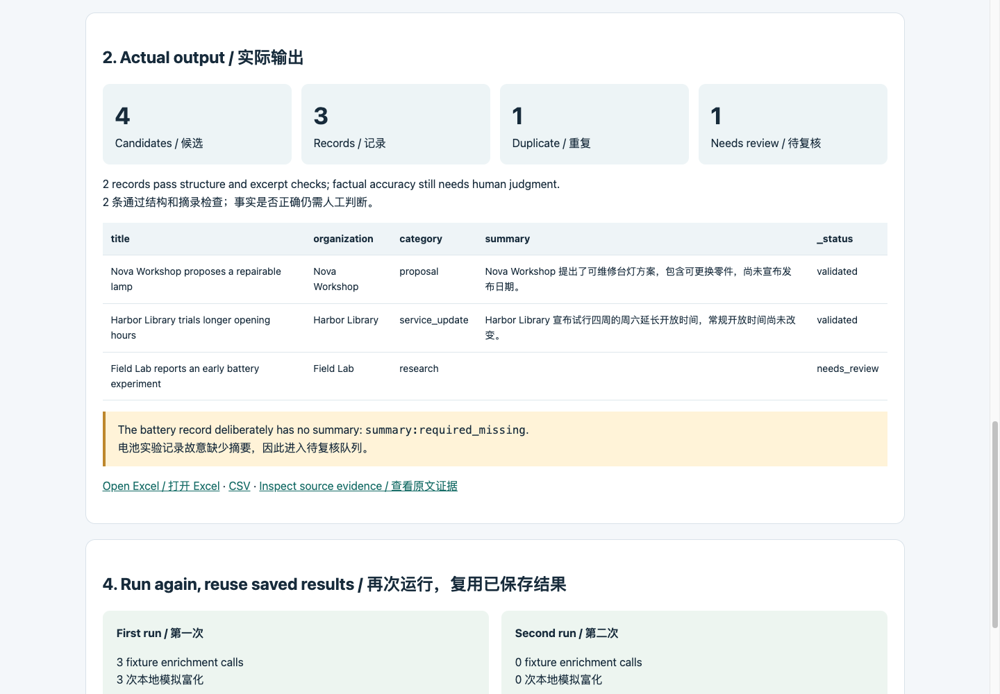
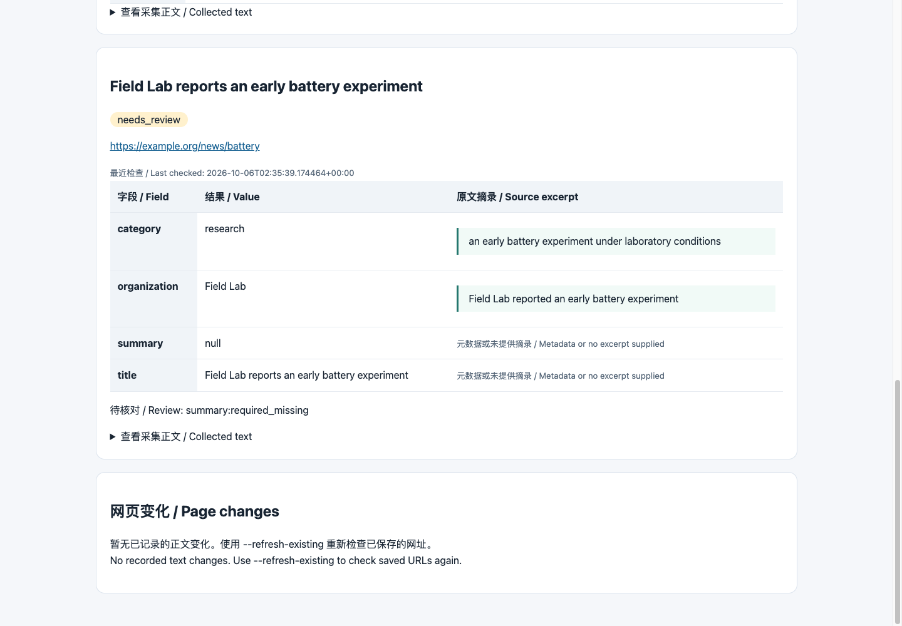

# 获得第一张带来源证据的信息表

[English](walkthrough.en.md) · [项目概览](../README.zh-CN.md)

**先跑通完整离线案例，再接入自己的来源与 API。** 需要 Python 3.9+、浏览器和约五分钟；无需第三方 Python 包、账号或 API 密钥。


[观看完整录屏](demo.mp4) · [中英双语字幕](demo.srt)

GIF 为 2 倍速预览；MP4 按实际操作顺序展示，剪除了较长的导航等待，并附中英文字幕。画面和统计来自自带虚构样例的真实运行结果。录屏展示生成的结果页面，不展示真实互联网搜索或模型质量。

## 这个案例展示什么

| 你提供 | 程序产出 |
| --- | --- |
| 虚构列表页、RSS 和预设关键词搜索结果 | 发现 4 个候选 |
| 本地文章文件与字段模板 | 导出 3 条记录，合并 1 条相同正文 |
| 预设富化结果 | 2 条通过结构与摘录检查，1 条待复核 |
| 在同一工作目录再次运行 | 复用已保存结果，不再调用模拟富化 |

机构、网址、文章和富化结果均为虚构。正文提取、去重、校验、持久化和导出实际执行；搜索和富化读取本地 fixture，不调用真实服务。`validated` 不表示事实已被确认。

## 1. 下载并生成案例

```sh
git clone https://github.com/workstonedai-collab/global-knowledge-crawl-pipeline.git
cd global-knowledge-crawl-pipeline
python3 examples/make_walkthrough.py
```

Windows 如无 `python3`，可使用 `py` 或 `python`。在项目目录运行。

辅助脚本运行两次现有演示，并从实际导出的 CSV 与运行报告生成可视页面，同时核对预期结果。它不请求真实搜索或模型。为保护已有状态，工作目录非空时会停止；再次体验请另选目录：

```sh
python3 examples/make_walkthrough.py --workspace runtime/visual-demo-2
```

## 2. 打开生成的页面

用浏览器打开 `runtime/visual-demo/output/walkthrough.html`。如果另选了工作目录，就打开相应目录下的文件。正常使用无需启动网页服务器。

- **输入**：查看来源、关键词和目标字段；可以展开实际示例配置。
- **结果**：查看表格、计数、下载入口和复核原因。
- **证据**：打开程序原有的 `evidence.html`，查看字段、原文摘录和正文。
- **复用**：对照首次和再次运行的报告。



## 3. 核对预期结果

| 检查项 | 预期 |
| --- | --- |
| 首次发现候选 | 4 |
| 导出记录 | 3 |
| 相同正文重复项 | 1 |
| 通过结构和摘录检查的记录 | 2 |
| 待复核记录 | 1 |
| 两次运行的 HTTP 请求 | 0 |
| 首次模拟富化调用 | 3 |
| 再次模拟富化调用 | 0 |

关键词搜索计数可能显示 1 次 **fixture** 调用，同时 HTTP 请求为 0。同样，离线示例的 `ai_calls` 统计本地模拟富化调用。这些计数均不表示这里请求了真实服务。

通过 Excel 链接或直接打开 `table.xlsx` 查看电子表格。浏览器中的表格来自导出的 CSV，是便于演示的查看页，不替代 Excel 文件。

## 4. 复核故意保留的不完整记录

**Field Lab** 的电池实验记录缺少必填摘要，因此进入 `needs_review`，原因是 `summary:required_missing`。请对照证据页和正文，再决定如何补充或处理。



原文描述的是早期实验室实验。流程保留了这一背景，不证明消费产品中的性能，也不证明模型解释一定正确。

## 5. 查看输出文件

```text
runtime/visual-demo/output/
  walkthrough.html         案例概览页
  evidence.html            字段、摘录、正文与变化
  table.xlsx               电子表格
  table.csv                CSV 表格
  records.jsonl            完整记录与来源
  review.json              待复核记录
  duplicates.json          相同正文重复关系
  first-run-report.json    原始首次运行统计
  second-run-report.json   再次运行的复用统计
```

运行结果保存在被 Git 忽略的工作目录中；无需提交示例输出或本地状态。

## 接入真实来源与服务

用[本地配置器](configuration-builder.md)创建自己的配置，再按照[适配器说明](adapters.md)替换占位来源和接口，选择字段模板，并在本地环境中设置凭据。先以小预算运行。

配置器生成配置文件，命令行执行采集。这个案例使用现成的离线 fixture 配置，不使用你从配置器下载的配置。初次学习时分别完成这两个练习。

录屏和发布材料不得包含密钥、私有接口、客户数据或内部来源清单。实际模型质量与网站兼容性需要另行验证。

## 可以直接交给 Agent 的任务

> 将 Global Knowledge Crawl Pipeline 克隆到新文件夹，检查 Python 3.9+。先用新的工作目录运行 examples/make_walkthrough.py，给我 walkthrough.html、table.xlsx 和 evidence.html 的路径。确认 4 个候选、3 条记录、1 条重复、1 条待复核，以及第二次运行不再调用模拟富化，并解释缺少摘要的记录。离线案例无需提供凭据。跑通后，再引导我设置自己的来源、字段模板、搜索 API 和富化 API；凭据保留在本地，先使用小预算。

## 验证范围

2026-10-06，基于 0.2.0 版录制。已检查示例、两次运行报告、导出的 CSV 和复核原因；已有 35 项测试通过。这是本地虚构案例演示，不代表已验证任意真实网站或真实模型输出。
